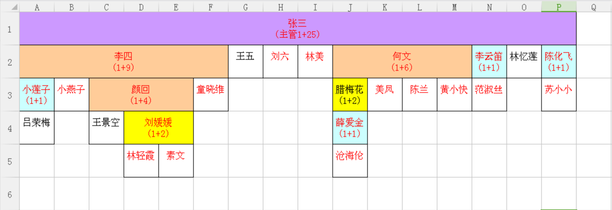

# vba 函数扩充

## 一、扩充CONCATENATE函数
1. CONCATENATE函数的使用
2. &连接符的使用
3. for each、range、variant等的用法
4. 定义一个参数数量可变的函数
5. 自定义连接函数

### 1、CONCATENATE函数的作用是什么？使用起来有哪些不方便的地方？
可以将几个文本字符串合并为一个文本字符串，这些文本项可以为文本字符串、数字或对单个单元格的引用。不方便的地方就是不能对连续选中的区域进行合并。

### 2、&的作用是什么？
和CONCATENATE功能一样，更方便一些。

### 3、想解决的问题：对选中的区域内的字符串进行合并。既可传入单一的单元格又可以传递一块区域，增加函数的灵活性。

	Function cat(r As Range)
	    Dim i As Variant
	    For Each i In r
	       cat = cat & i
	    Next i
	End Function

### 4、如果想传递两个不连续的区域呢？

	Function bigCat(r1 As Range, Optional r2 As Range, Optional r3 As Range)
	    Dim i, j, k As Variant
	    For Each i In r1
	       bigCat = bigCat & i
	    Next i
	    
	    If Not r2 Is Nothing Then
	        For Each j In r2
	            bigCat = bigCat & j
	        Next j
	    End If
	    
	    If Not r3 Is Nothing Then
	        For Each k In r3
	            bigCat = bigCat & k
	        Next k
	    End If
	End Function

### 5、如果想传递任意个数不连续的区域呢？

	Function bossCat(ParamArray r())
	    Dim ub As Integer
	    ub = UBound(r)
	    Dim i As Integer
	    Dim k As Variant
	    For i = 0 To ub
	        For Each k In r(i)
	            bossCat = bossCat & k
	        Next k
	    Next i
	End Function

但是又有一个问题出现了：就是无法连接用户输入的数据，这个时候该怎么办呢？把参数里面的range改成variant，然后利用typename判断这个参数是否为range。

## 二、生成自动架构图

数据格式：

|地区|营业组|号码|姓名|日期|上级号码|上级姓名|可选数据|
|:---:|:---:|:---:|:---:|:---:|:---:|:---:|:---:|
|长江|张三组|37941173|张三|2014-10-28|37939285||17414| 
|长江|张三组|37946118|李四|2014-11-09|37941173|张三|7097|
|长江|张三组|37950457|王五|2014-11-15|37941173|张三|2416|
|...|...|...|...|...|...|...|...|

生成的架构图：

### 1、创建MyCell类

变量声明：

	Private row$ '所在行号（例如2）
	Private col$ '所在列号（例如2）
	Private width$ '列跨度（例如4）,初始值为0
	Private isLast$ '判断是否是每行最右边的
	Private children$ '下面直增个数（例如5）
	Private descendants$ '下面所有子节点个数
	Private name As String '业务员的姓名（例如周亮）
	Private attr As String '职级名称（例如中支主任）
	Private no As String '工号
	Private bb As String '标保
	Private fyc As String 'fyc
	Private upper As MyCell '上级表格（弄清上级关系）
	Private right As MyCell '右边表格（弄清同级关系）
	Private down As MyCell '下级表格（第一个子节点弄清下级关系）

为变量添加getter和setter：

	'获取行号值
	Public Property Get rowV() As Integer
	  rowV = row
	End Property
	'给行号赋值
	Public Property Let rowV(ByVal setRow As Integer)
	  row = setRow
	End Property

	'获取列号值
	Public Property Get colV() As Integer
	  colV = col
	End Property
	'给列号赋值
	Public Property Let colV(ByVal setCol As Integer)
	  col = setCol
	End Property

	'获取跨度值
	Public Property Get widthV() As Integer
	  widthV = width
	End Property
	'给跨度赋值（注意，要修改上级跨度值）
	Public Property Let widthV(ByVal setWidth As Integer)
	  width = setWidth
	End Property

	'获取是否最右值
	Public Property Get isLastV() As Integer
	  isLastV = isLast
	End Property
	'给是否最右赋值
	Public Property Let isLastV(ByVal setisLast As Integer)
	  isLast = setisLast
	End Property

	'获取直增值
	Public Property Get childrenV() As Integer
	  childrenV = children
	End Property
	'给直增赋值
	Public Property Let childrenV(ByVal setChildren As Integer)
	  children = setChildren
	End Property

	'获取后代值
	Public Property Get descendantsV() As Integer
	  descendantsV = descendants
	End Property
	'给后代赋值
	Public Property Let descendantsV(ByVal setDescendants As Integer)
	  descendants = setDescendants
	End Property

	'给姓名赋值
	Public Property Let nameV(ByVal setName As String)
	  name = setName
	End Property
	'获取姓名值
	Public Property Get nameV() As String
	  nameV = name
	End Property

	'给FYC赋值
	Public Property Let fycV(ByVal setFyc As String)
	  fyc = setFyc
	End Property
	'获取FYC值
	Public Property Get fycV() As String
	  fycV = fyc
	End Property

	'给属性赋值
	Public Property Let attrV(ByVal setAttr As String)
	  attr = setAttr
	End Property
	'获取属性值
	Public Property Get attrV() As String
	  attrV = attr
	End Property

	'给工号赋值
	Public Property Let noV(ByVal setNo As String)
	  no = setNo
	End Property
	'获取工号值
	Public Property Get noV() As String
	  noV = no
	End Property

	'给标保赋值
	Public Property Let bbV(ByVal setBb As String)
	  bb = setBb
	End Property
	'获取标保值
	Public Property Get bbV() As String
	  bbV = bb
	End Property

	'给上级赋值
	Public Property Let upperV(ByRef setUpper As MyCell)
	  Set upper = setUpper
	End Property
	'获取上级值
	Public Property Get upperV() As MyCell
	  Set upperV = upper
	End Property

	'给右级赋值
	Public Property Let rightV(ByRef setRight As MyCell)
	  Set right = setRight
	End Property
	'获取右级值
	Public Property Get rightV() As MyCell
	  Set rightV = right
	End Property

	'给下级赋值
	Public Property Let downV(ByRef setDown As MyCell)
	  Set down = setDown
	End Property
	'获取下级值
	Public Property Get downV() As MyCell
	  Set downV = down
	End Property

递归插入：

	Public Sub insert()
	    If Not upper Is Nothing Then '如果上级不是空节点，说明不是根节点，还要递归调用upper.insert，否则只需要增加跨度
	        Debug.Print attr
	        Debug.Print "在insert开始"
	        'Columns(col + 1).insert '插入一列
	        width = width + 1 '跨度增加
	        'moveRight '递归调用MoveRight函数，确保兄弟节点能够右移 moveright函数根本就没有作用嘛
	        Debug.Print "在insert中间"
	        'Application.DisplayAlerts = False '取消合并单元格的提示
	        'Range(cells(row + 0, col + 0), cells(row + 0, col + 0 + width)).Merge '合并单元格
	        Debug.Print "在insert的merge之后"
	        upper.insert '调用父节点函数
	        Debug.Print "在insert结束"
	    Else
	        Debug.Print "我进来啦"
	        width = width + 1 '根节点跨度始终要增加的
	        Debug.Print col + 0 + width
	        'Range(cells(row + 0, col + 0), cells(row + 0, col + 0 + width)).Merge '合并单元格
	    End If
	End Sub

	'插入后，右侧单元格全部右移
	Public Sub moveRight()
	    Debug.Print "进入moveRight模块"
	    If isLast = 0 Then '只要不是最后一个就继续右移
	        right.col = right.col + 1
	        right.moveRight
	    End If
	    Debug.Print "出去了moveright"
	End Sub

### 2、创建Panel类

变量声明：

    'Public train As New Collection '创建集合
    Dim cellsArray() As MyCell '创建保存MyCell的数组
    Public nameCol, noCol, upperCol, attrCol, fycCol As Integer '属性在表中的列数（重复利用）
    Dim maxRow As Integer '最大行数
    Dim index As Integer '数组位置计数器
    Dim dataSheet As String
 
main函数：

	Public Sub main()
	    Debug.Print "进入main"
	    dataSheet = "数据源"
	    destiSheet = "架构图"
	    nameCol = 4 '姓名列
	    noCol = 3 '工号列
	    upperCol = 6 '上级列
	    bbCol = 7 '标保列
	    fycCol = 8 'FYC列
	    
	    'attrCol = 7 '属性列
	    'MsgBox Sheets(dataSheet).UsedRange.Rows.Count
	    maxRow = Sheets(dataSheet).UsedRange.Rows.Count '最大行数
	    Debug.Print "maxRow:" & maxRow
	    ReDim cellsArray(maxRow) '定义数组的行数
	    index = 0 '数组初始值
	    
	    
	    '创建第一个主管节点（主管节点没有upper和right）
	    Set cellsArray(0) = New MyCell '主管节点
	    cellsArray(0).nameV = Sheets(dataSheet).Cells(2, nameCol).Value '主管姓名
	    'cellsArray(0).attrV = Sheets(dataSheet).cells(2, attrCol).Value '主管职级
	    cellsArray(0).noV = Sheets(dataSheet).Cells(2, noCol).Value '主管工号
	    cellsArray(0).bbV = Sheets(dataSheet).Cells(2, bbCol).Value '标保
	    cellsArray(0).rowV = 1 '主管行(不变)
	    cellsArray(0).colV = 1 '主管列(不变)
	    cellsArray(0).widthV = 0 '主管跨度(初值为0，实际值会改变)
	    cellsArray(0).isLastV = 1 '是否最后(不变)
	    cellsArray(0).childrenV = 0 '有几个子节点(初值为0，实际值会改变)
	    cellsArray(0).fycV = Sheets(dataSheet).Cells(2, fycCol).Value 'FYC
	    'MsgBox Sheets(dataSheet).Cells(2, fycCol).Value
	    'cellsArray(0).descendantsV = maxRow - 2 '父节点子孙数
	    Debug.Print cellsArray(0).upperV Is Nothing '测试上级节点是否为空节点
	    'CellsArray(0).dayin
	    'Set CellsArray(1) = New MyCell '注意，创建一个新对象的时候一定要用Set！
	    'Set CellsArray(1) = CellsArray(0)
	    Debug.Print "开始找孩子"
	    findChildren cellsArray(0) '从主管节点开始不断寻找子节点
	    'Dim i As Integer
	    'ActiveSheet.Clear
	    Sheets(destiSheet).Select
	    
	    Sheets(destiSheet).Cells.Clear
	    drawFromZG
	End Sub

以主管为起点画架构图：

	Sub drawFromZG()
	    Dim autoAttr As String
	    For i = 0 To cellsArray(0).descendantsV
	        'Debug.Print i
	        cellsArray(i).dayin
	        Application.DisplayAlerts = False '取消合并单元格的提示

	        If CDbl(cellsArray(i).fycV) >= 3000 Then
	        
	            With Range(Cells(cellsArray(i).rowV + 0, cellsArray(i).colV + 0), Cells(cellsArray(i).rowV + 0, cellsArray(i).colV + 0 + cellsArray(i).widthV))
	            .Font.ColorIndex = 3
	            '.Interior.ColorIndex = 40
	            '.Interior.Pattern = xlPatternGray8
	            '.Interior.PatternColorIndex = 36
	            End With
	      		
	        End If
	        
	        Range(Cells(cellsArray(i).rowV + 0, cellsArray(i).colV + 0), Cells(cellsArray(i).rowV + 0, cellsArray(i).colV + 0 + cellsArray(i).widthV)).Merge '合并单元格
	        Range(Cells(cellsArray(i).rowV + 0, cellsArray(i).colV + 0), Cells(cellsArray(i).rowV + 0, cellsArray(i).colV + 0)).Value = cellsArray(i).nameV & autoAttr & Chr(10) & Round(CDbl(cellsArray(i).fycV), 0)
	        
	        Range(Cells(cellsArray(i).rowV + 0, cellsArray(i).colV + 0), Cells(cellsArray(i).rowV + 0, cellsArray(i).colV + 0 + cellsArray(i).widthV)).HorizontalAlignment = xlCenter '文字居中
	        Range(Cells(cellsArray(i).rowV + 0, cellsArray(i).colV + 0), Cells(cellsArray(i).rowV + 0, cellsArray(i).colV + 0 + cellsArray(i).widthV)).Borders.LineStyle = xlContinuous '添加边框
	        
	    Next i
	End Sub

寻找指定节点的子节点：

	Sub findChildren(father As MyCell)
	    Dim childrenCount As Integer '直增数量计数器
	    childrenCount = 0 '直增初始值为0（没有直增）
	    
	    Dim former As New MyCell '定义上一个节点，用于指向右边兄弟节点
	    Set former = father '上一个节点的初始值就是父节点本身
	    Debug.Print "baba"
	    '为什么从3开始？因为第一行是标题行，第二行是根节点行
	    For i = 3 To maxRow
	        If Sheets(dataSheet).Cells(i, upperCol).Value = father.noV Then '如果父节点工号是给定根节点工号（表明发现直增）
	            
	            childrenCount = childrenCount + 1 '直增加1
	            index = index + 1 '数组位置计数器加1
	            Set cellsArray(index) = New MyCell '新建节点（在新的数组位置上添加新节点）
	            
	            '设置新节点的属性(行数根据父节点来，列数根据左节点来)
	            cellsArray(index).rowV = father.rowV + 1 '子节点行数=父节点行数+1
	            cellsArray(index).upperV = father '指定该节点的父节点
	            cellsArray(index).widthV = 0 '新节点的初始跨度都为0，跨度只有在insert的时候才会改变
	            cellsArray(index).nameV = Sheets(dataSheet).Cells(i, nameCol) '设置姓名
	            cellsArray(index).fycV = Sheets(dataSheet).Cells(i, fycCol) '设置fyc
	           ' MsgBox "i=" & i & ",nameCol=" & nameCol & ",fycCol=" & fycCol & ",nameV=" & Sheets(dataSheet).Cells(i, fycCol) & ",fycV=" & Sheets(dataSheet).Cells(i, fycCol)
	            'cellsArray(index).attrV = Sheets(dataSheet).cells(i, attrCol) '设置属性
	            cellsArray(index).noV = Sheets(dataSheet).Cells(i, noCol) '设置工号
	            
	            Debug.Print "目前新节点是：" + cellsArray(index).nameV
	            If Not former Is father Then '如果上一个节点不是父节点，说明former是它左边的兄弟节点
	                former.rightV = cellsArray(index) '设置former右边节点为新节点
	                former.isLastV = 0 '设置former的isLast的值为0，表明former不是father节点的最后一个子节点
	                Debug.Print former.nameV
	                cellsArray(index).colV = former.colV + former.widthV + 1 '列数等于former节点列数+former节点的跨度
	                Set former = cellsArray(index) '将上一个节点更换为当前节点
	                Debug.Print father.nameV
	                father.insert '父节点要插入一行(父节点的单元格要右移）
	                Debug.Print "wawa"
	            Else '说明当前节点是father的第一个节点
	                cellsArray(index).colV = father.colV '第一个节点的列数肯定是1（大错特错！）第一个节点列数肯定是父节点列数
	                Set former = cellsArray(index) '将former节点设置为father的第一个子节点
	            End If
	            
	            '一旦找到子节点，马上让子节点寻找自己的子节点（递归寻找，一步到位），关键是在这个时候不知道自己是不是最右节点
	            '不妨假设不是最右节点，没有影响的，因为哈哈，我设计好了，列数=former+width+1
	            cellsArray(index).isLastV = 0
	            
	            If childrenCount = 1 Then '如果子节点计数器是1，表明当前节点是father节点的第一个子节点
	                Debug.Print "进入down"
	                father.downV = cellsArray(index)
	                Debug.Print "出去down"
	            End If
	            
	            findChildren cellsArray(index)
	           
	        End If
	    Next i
	    
	    If Not former Is father Then '用这种方式比较两个对象
	        Debug.Print "hello"
	        former.isLastV = 1 '最后一个former肯定是father节点的最后一个子节点
	    End If
	    
	    father.childrenV = childrenCount '指定父节点的孩子数量
	    
	    Dim countDescendants As Integer
	    countDescendants = 0
	    If childrenCount = 0 Then
	        father.descendantsV = 0
	    Else
	        Dim getChild As MyCell
	        Set getChild = father.downV
	        Do While Not getChild Is Nothing
	            countDescendants = countDescendants + getChild.descendantsV + 1
	            Set getChild = getChild.rightV
	        Loop
	    End If
	    father.descendantsV = countDescendants
	End Sub

### 3、运行

	Sub 运行()
	    Dim p As New Panel
	    p.main
	End Sub